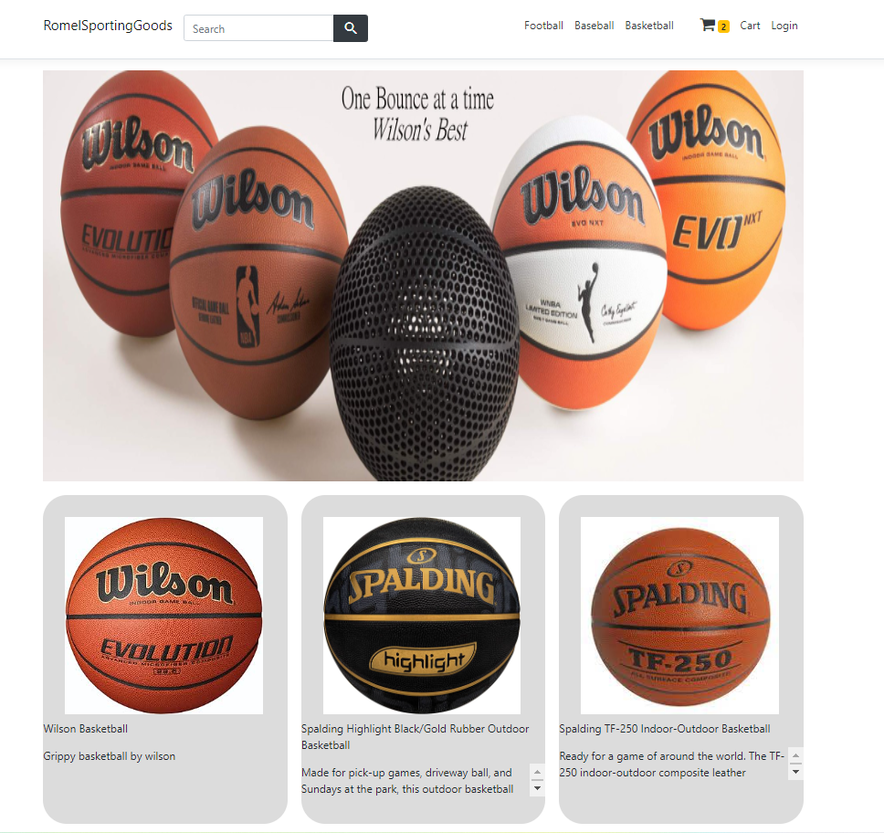
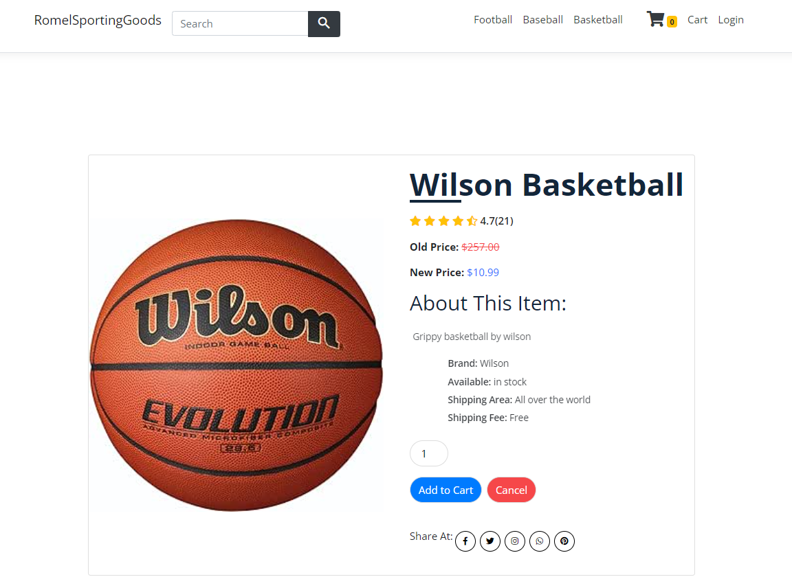
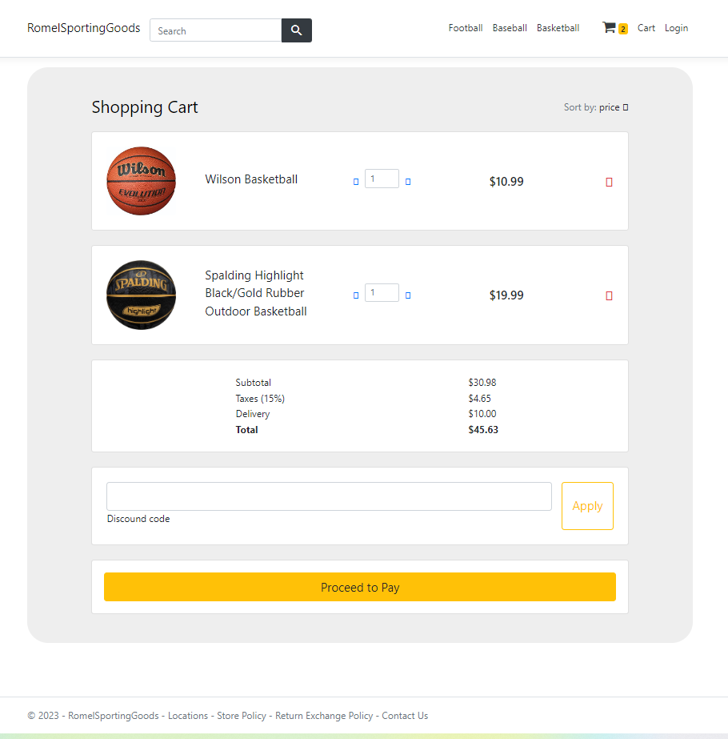
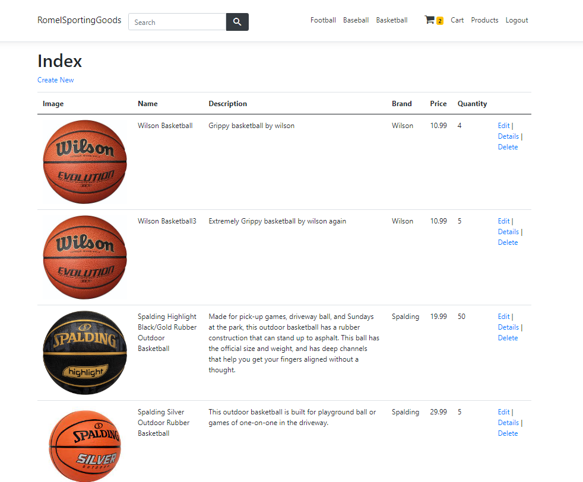
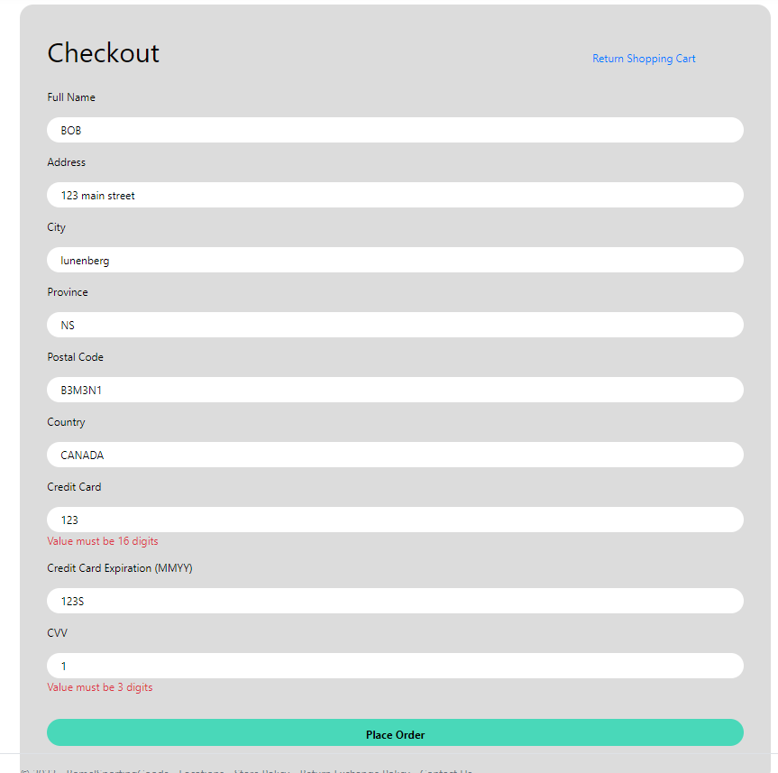

# SportsGoodsStore — E-commerce Web Application

SportsGoodsStore is an ASP.NET Core e-commerce application with role-based access control and Azure SQL persistence. The system includes product management, shopping cart functionality, checkout validation, and an admin interface.

---

## Overview

The application supports two roles:

- **Customers** can browse products, manage a shopping cart, and complete checkout.
- **Admins** can add, edit, and delete products through a restricted interface.

Authorization rules ensure only admins can modify inventory.

---

## Implementation Details

- Full CRUD operations for products
- Shopping cart with dynamic quantity and total price calculation
- Checkout form with server-side validation
- Role-based authorization using ASP.NET Identity
- Azure SQL database for persistent storage
- Server-rendered UI using Razor Pages

---

## Tech Stack

- ASP.NET Core 8
- C#
- Razor Pages
- ASP.NET Identity
- Azure SQL Database
- HTML / CSS

---

## Screenshots

